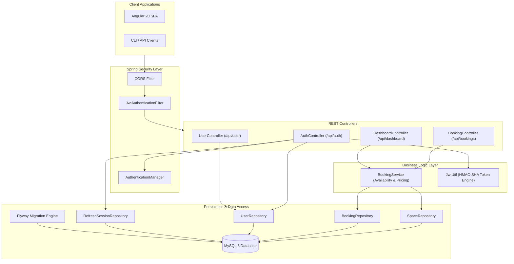
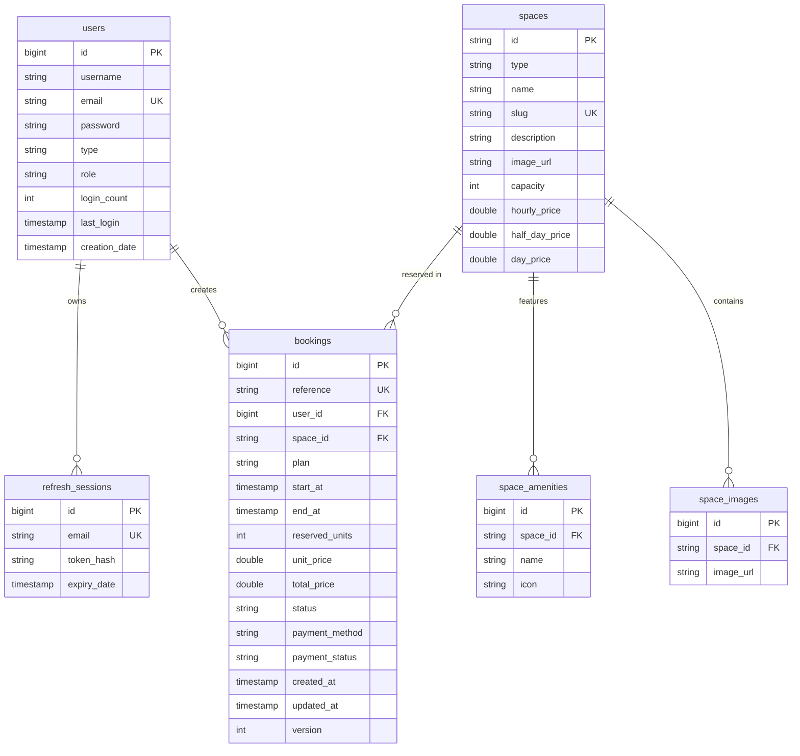
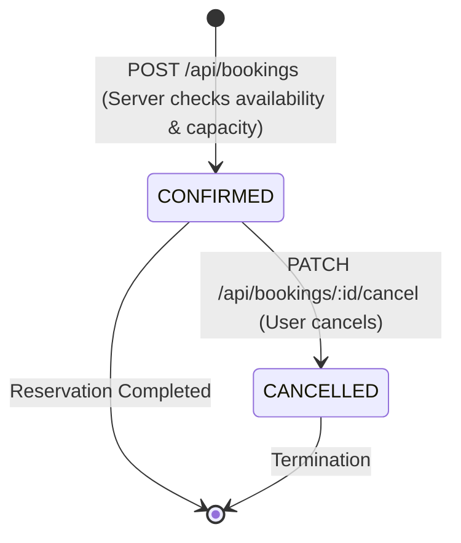
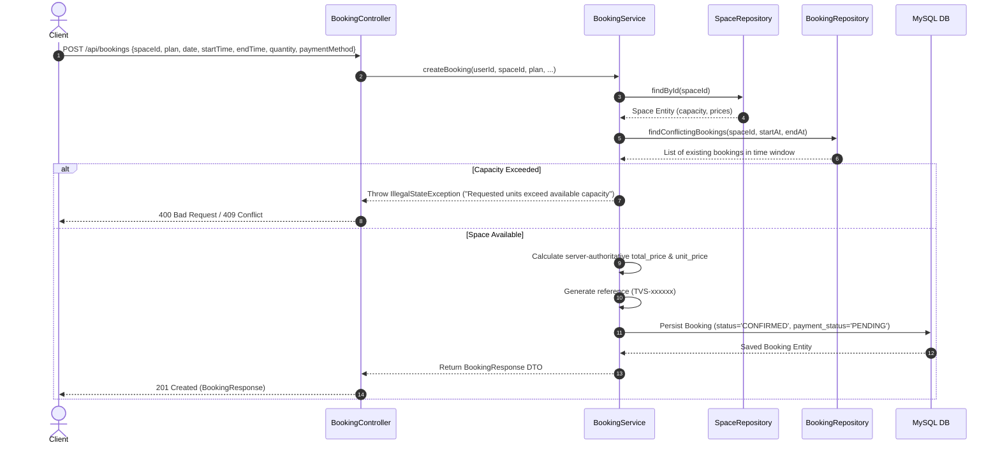

# TVS Spaces | Server Application

[](https://spring.io/projects/spring-boot)
[](https://www.oracle.com/java/)
[](https://spring.io/projects/spring-security)
[](https://www.mysql.com/)
[](https://flywaydb.org/)
[](https://tvs-spaces-back.onrender.com)

The enterprise Spring Boot REST API for **TVS Spaces**, powering workspace catalog management, real-time availability checks, server-authoritative price calculation, JWT session rotation, and booking persistence.

> **Frontend Repository**: [`shawky2002020/tvs-spaces`](https://github.com/shawky2002020/tvs-spaces)  
> **Live API Base URL**: `https://tvs-spaces-back.onrender.com/api`

---

## Table of Contents

- [System Architecture](#system-architecture)
- [Domain Model (ERD)](#domain-model-erd)
- [Authentication Architecture](#authentication-architecture)
- [Booking Lifecycle](#booking-lifecycle)
- [Booking Creation Sequence](#booking-creation-sequence)
- [API Endpoint Reference](#api-endpoint-reference)
- [Security Implementation](#security-implementation)
- [Database Migrations & Seeding](#database-migrations--seeding)
- [Project Directory Structure](#project-directory-structure)
- [Environment Variables](#environment-variables)
- [Local Development & Setup](#local-development--setup)
- [Testing & Quality Assurance](#testing--quality-assurance)
- [Deployment Model](#deployment-model)
- [Known Limitations](#known-limitations)

---

## System Architecture



---

## Domain Model (ERD)

The database schema is managed declaratively by **Flyway** (`V1__init_schema.sql`) and mapped to JPA entities.



---

## Authentication Architecture

TVS Spaces implements a **Dual-JWT Token Architecture** with HttpOnly refresh cookies:

- **Access Token**: Short-lived (15 minutes) signed JWT containing subject (`userId`), claims (`role`, `type="access"`), passed in HTTP header `Authorization: Bearer <token>`.
- **Refresh Token**: Long-lived (7 days) signed JWT (`type="refresh"`), stored in an `HttpOnly`, `SameSite` cookie.
- **SHA-256 Hash Verification**: When `/api/auth/refresh` is invoked, the refresh token is verified against a SHA-256 hash stored in the `refresh_sessions` database table, defending against token manipulation.

```mermaid
sequenceDiagram
    autonumber
    actor Client
    participant Controller as AuthController
    participant Manager as AuthenticationManager
    participant Jwt as JwtUtil
    participant DB as MySQL DB

    Client->>Controller: POST /api/auth/login {email, password}
    Controller->>Manager: authenticate(UsernamePasswordAuthenticationToken)
    Manager->>DB: Fetch user & verify BCrypt password
    Controller->>Jwt: generateToken(userId, 15m, "access")
    Controller->>Jwt: generateToken(userId, 7d, "refresh")
    Controller->>DB: Hash refresh token (SHA-256) & save to refresh_sessions
    Controller-->>Client: 200 OK Body: {token: AccessToken, user: UserDTO}<br/>Set-Cookie: refresh_token=HttpOnly; SameSite=Lax
```

---

## Booking Lifecycle

Bookings transitions are enforced by `BookingService`:



---

## Booking Creation Sequence



---

## API Endpoint Reference

### 1. Authentication Endpoints (`/api/auth`)

| Method | Endpoint | Auth | Purpose |
| :--- | :--- | :--- | :--- |
| `POST` | `/api/auth/signup` | Public | Register new user account & return session tokens |
| `POST` | `/api/auth/login` | Public | Authenticate user credentials & issue JWT access token + refresh cookie |
| `POST` | `/api/auth/refresh` | Public | Rotate refresh session & issue new access token |
| `POST` | `/api/auth/logout` | Public | Clear refresh cookie & delete session hash from database |

### 2. Workspace & Catalog Endpoints (`/api/bookings/spaces`)

| Method | Endpoint | Auth | Purpose |
| :--- | :--- | :--- | :--- |
| `GET` | `/api/bookings/spaces` | Public | Fetch all available coworking desks & meeting rooms |
| `GET` | `/api/bookings/spaces/{id}` | Public | Fetch specific workspace by ID |
| `GET` | `/api/bookings/spaces/slug/{slug}` | Public | Fetch specific workspace by unique URL slug |

### 3. Availability & Price Calculation (`/api/bookings`)

| Method | Endpoint | Auth | Purpose |
| :--- | :--- | :--- | :--- |
| `GET` | `/api/bookings/{spaceId}/availability/{date}` | Public | Fetch 24-hour hourly capacity utilization grid |
| `GET` | `/api/bookings/{spaceId}/unavailable-dates/{year}/{month}` | Public | Fetch dates where workspace is fully booked |
| `POST` | `/api/bookings/availability` | Public | Check if requested units/plan are available for date range |
| `POST` | `/api/bookings/calculate-price` | Public | Calculate server-authoritative price quote |

### 4. Reservation Management (`/api/bookings`)

| Method | Endpoint | Auth | Purpose |
| :--- | :--- | :--- | :--- |
| `POST` | `/api/bookings` | User | Create a new workspace reservation |
| `GET` | `/api/bookings/me` | User | Fetch all reservations belonging to authenticated user |
| `PATCH` | `/api/bookings/{id}/cancel` | User | Cancel an upcoming active reservation |

### 5. User & Dashboard Endpoints (`/api/dashboard` & `/api/user`)

| Method | Endpoint | Auth | Purpose |
| :--- | :--- | :--- | :--- |
| `GET` | `/api/dashboard/stats` | User | Fetch user reservation metrics (active, upcoming, completed, cancelled) |
| `PATCH` | `/api/user/edit` | User | Update user profile details, email, or password |
| `GET` | `/actuator/health` | Public | Spring Actuator health check verification |

---

## Security Implementation

- **Password Hashing**: `BCryptPasswordEncoder` with strength 10.
- **Stateless Session**: Spring Security `SessionCreationPolicy.STATELESS`.
- **JWT Key**: HMAC-SHA256 signing using base64 secret configured via `app.jwtSecret`.
- **Cookie Security**: `HttpOnly`, `SameSite=Lax` (configurable to `None` for cross-site prod deployments), `Secure=true` over HTTPS.
- **Exception Handling**: Custom `CustomAuthenticationEntryPoint` (401) and `CustomAccessDeniedHandler` (403) returning clean JSON error responses.

---

## Database Migrations & Seeding

Flyway automatically executes database migrations upon application startup:

- **Location**: `src/main/resources/db/migration/V1__init_schema.sql`
- **Tables**: `users`, `spaces`, `space_images`, `space_amenities`, `bookings`, `refresh_sessions`.
- **Pre-Seeded Catalog**:
  1. **Shared Desk** (`shared-desk`): 7 seats capacity, EGP 40/hr, EGP 35/half-day, EGP 32/day.
  2. **Solo Desk** (`solo-desk`): 1 seat capacity, EGP 50/hr, EGP 45/half-day, EGP 42/day.
  3. **PC Station** (`pc-station`): 3 stations capacity, EGP 60/hr, EGP 55/half-day, EGP 52/day.
  4. **Team Room** (`team-room`): 1 room capacity (2-4 people), EGP 120/hr, EGP 115/half-day, EGP 110/day.
  5. **Big Meeting Room** (`big-meeting-room`): 1 room capacity (10+ people), EGP 200/hr, EGP 190/half-day, EGP 185/day.

---

## Project Directory Structure

```text
server/
├── src/
│   ├── main/
│   │   ├── java/org/example/spacesback/
│   │   │   ├── controller/         # REST Endpoints (Auth, Booking, User, Dashboard)
│   │   │   ├── dto/                # Request & Response DTOs + Mappers
│   │   │   ├── exception/          # GlobalExceptionHandler (ApiExceptionHandler)
│   │   │   ├── model/              # JPA Entities (User, Space, Booking, RefreshSession)
│   │   │   ├── repository/         # Spring Data Repositories
│   │   │   ├── security/           # JwtUtil, JwtAuthenticationFilter, SecurityConfig
│   │   │   ├── service/            # BookingService & Business Logic
│   │   │   └── SpacesBackApplication.java
│   │   └── resources/
│   │       ├── db/migration/       # Flyway SQL migrations
│   │       ├── application.properties
│   │       ├── application-local.properties
│   │       ├── application-prod.properties
│   │       └── application-test.properties
│   └── test/                       # JUnit 5 & Integration tests
├── pom.xml                         # Maven dependencies & build plugins
└── mvnw / mvnw.cmd                 # Maven wrapper scripts
```

---

## Environment Variables

| Variable | Required | Default (Local) | Purpose | Safe Example |
| :--- | :--- | :--- | :--- | :--- |
| `SPRING_PROFILES_ACTIVE` | No | `local` | Active Spring profile (`local`, `prod`, `test`) | `local` |
| `SPRING_DATASOURCE_URL` | Yes | `jdbc:mysql://localhost:3306/tvs_spaces` | JDBC connection string | `jdbc:mysql://localhost:3306/tvs_spaces?useSSL=false` |
| `SPRING_DATASOURCE_USERNAME` | Yes | `root` | MySQL database username | `tvs_user` |
| `SPRING_DATASOURCE_PASSWORD` | Yes | `root` | MySQL database password | `secret_password` |
| `APP_JWT_SECRET` | Yes | `d3ZzLXNwYWNlcy1zZWNyZXQta2V5LXNlY3VyZS0yNTYtYml0` | Base64 HMAC-SHA256 secret key | `YOUR_BASE64_SECRET` |
| `APP_JWT_EXPIRATION_MS` | No | `900000` (15 min) | Access token validity in milliseconds | `900000` |
| `APP_JWT_REFRESH_EXPIRATION_MS` | No | `604800000` (7 days) | Refresh token validity in milliseconds | `604800000` |
| `APP_CORS_ALLOWED_ORIGINS` | No | `http://localhost:4200` | Allowed CORS origins (comma-separated) | `https://client-three-zeta-29.vercel.app` |
| `APP_COOKIE_SECURE` | No | `false` | Enable Secure flag on refresh cookie | `true` |
| `APP_COOKIE_SAME_SITE` | No | `Lax` | SameSite cookie policy (`Lax`, `Strict`, `None`) | `None` |

---

## Local Development & Setup

### Step 1: Clone & Configure MySQL
Ensure MySQL 8 is running locally and create the database:
```sql
CREATE DATABASE tvs_spaces;
```

### Step 2: Run Server with Local Profile
Using Windows PowerShell / Command Prompt:
```powershell
.\mvnw.cmd spring-boot:run "-Dspring-boot.run.profiles=local"
```
Or Linux / macOS Bash:
```bash
./mvnw spring-boot:run -Dspring-boot.run.profiles=local
```

### Step 3: Health Verification
Verify that the API server is healthy on port `8080`:
```bash
curl http://localhost:8080/actuator/health
```
Output:
```json
{"status":"UP"}
```

---

## Testing & Quality Assurance

Run the test suite using the Maven wrapper:

```bash
./mvnw test
```

The test profile (`application-test.properties`) utilizes an in-memory **H2 database** with MySQL compatibility mode to run isolated repository and service tests without requiring a running MySQL instance.

---

## Deployment Model

The backend API is deployed on **Render** connected to a managed **Aiven MySQL** instance:

```text
Angular Frontend (Vercel)
       │
       ▼ (HTTPS REST API / JSON)
Spring Boot Server (Render Cloud)
       │
       ▼ (TLS Encrypted JDBC)
Aiven MySQL Cloud Database
```

---

## Known Limitations

- **Payment Gateway Integration**: Payment status defaults to `PENDING` upon booking creation. Real-time webhook handlers for credit card processing (e.g. Stripe, Paymob) are ready in domain DTOs but require live merchant keys.
- **Single-Node Locking**: Concurrent availability revalidation uses pessimistic database queries (`findConflictingBookings`) which suit single-node deployments. Distributed Redis locking would be recommended for multi-region clustering.
