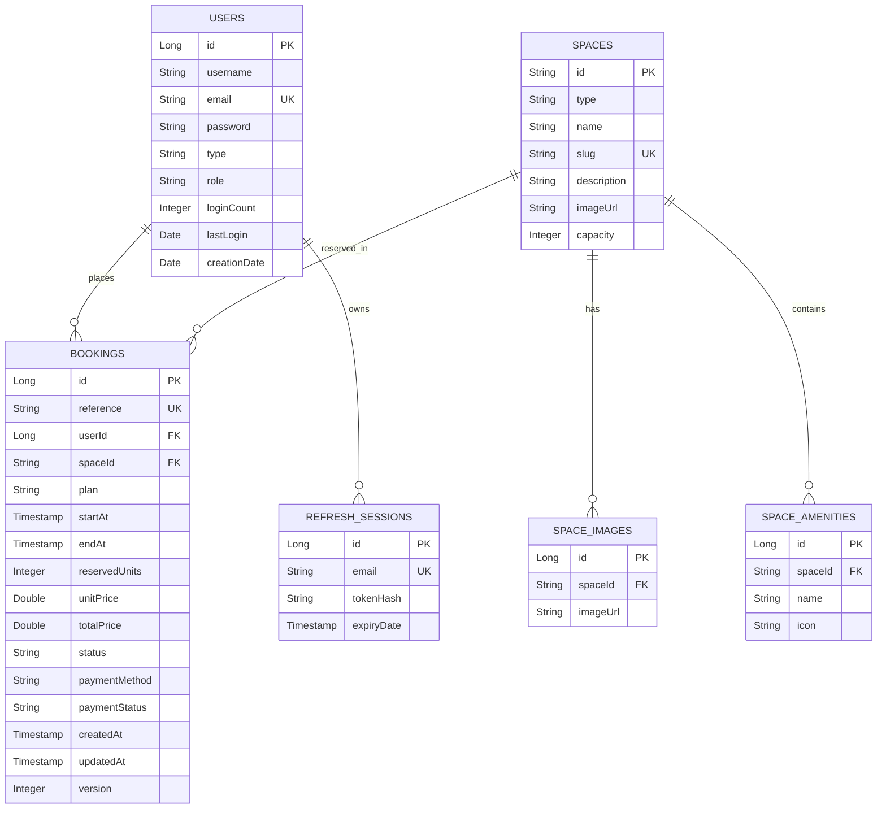

# TVS Spaces Data Model

## 1. ER Diagram

## 2. Table Schemas and Constraints

### `users`
*   `id`: `BIGINT AUTO_INCREMENT PRIMARY KEY`
*   `email`: `VARCHAR(191) UNIQUE NOT NULL`
*   `username`: `VARCHAR(100) NOT NULL`
*   `password`: `VARCHAR(255) NOT NULL`
*   `type`: `VARCHAR(50) NOT NULL`
*   `role`: `VARCHAR(50) NOT NULL DEFAULT 'ROLE_USER'`
*   `login_count`: `INT DEFAULT 0`
*   `last_login`: `TIMESTAMP`
*   `creation_date`: `TIMESTAMP`

### `spaces`
*   `id`: `VARCHAR(50) PRIMARY KEY`
*   `type`: `VARCHAR(20) NOT NULL` -- 'desk' or 'room'
*   `name`: `VARCHAR(100) NOT NULL`
*   `slug`: `VARCHAR(100) UNIQUE NOT NULL`
*   `description`: `TEXT`
*   `image_url`: `VARCHAR(255)`
*   `capacity`: `INT NOT NULL`
*   `hourly_price`: `DOUBLE NOT NULL`
*   `half_day_price`: `DOUBLE NOT NULL`
*   `day_price`: `DOUBLE NOT NULL`

### `space_images`
*   `id`: `BIGINT AUTO_INCREMENT PRIMARY KEY`
*   `space_id`: `VARCHAR(50) REFERENCES spaces(id) ON DELETE CASCADE`
*   `image_url`: `VARCHAR(255) NOT NULL`

### `space_amenities`
*   `id`: `BIGINT AUTO_INCREMENT PRIMARY KEY`
*   `space_id`: `VARCHAR(50) REFERENCES spaces(id) ON DELETE CASCADE`
*   `name`: `VARCHAR(50) NOT NULL`
*   `icon`: `VARCHAR(50) NOT NULL`

### `bookings`
*   `id`: `BIGINT AUTO_INCREMENT PRIMARY KEY`
*   `reference`: `VARCHAR(50) UNIQUE NOT NULL`
*   `user_id`: `BIGINT REFERENCES users(id)`
*   `space_id`: `VARCHAR(50) REFERENCES spaces(id)`
*   `plan`: `VARCHAR(20) NOT NULL` -- 'Hourly', 'Half-day', 'Daily', 'Monthly'
*   `start_at`: `TIMESTAMP NOT NULL`
*   `end_at`: `TIMESTAMP NOT NULL`
*   `reserved_units`: `INT NOT NULL`
*   `unit_price`: `DOUBLE NOT NULL`
*   `total_price`: `DOUBLE NOT NULL`
*   `status`: `VARCHAR(20) NOT NULL` -- 'CONFIRMED', 'CANCELLED'
*   `payment_method`: `VARCHAR(50) NOT NULL`
*   `payment_status`: `VARCHAR(50) NOT NULL`
*   `created_at`: `TIMESTAMP NOT NULL`
*   `updated_at`: `TIMESTAMP NOT NULL`
*   `version`: `INT DEFAULT 0` -- Optimistic Lock

### `refresh_sessions`
*   `id`: `BIGINT AUTO_INCREMENT PRIMARY KEY`
*   `email`: `VARCHAR(191) UNIQUE NOT NULL`
*   `token_hash`: `VARCHAR(255) NOT NULL`
*   `expiry_date`: `TIMESTAMP NOT NULL`

## 3. Booking Overlap and Capacity Validation Rules
To check if a space is available for a requested slot:
1. Find all active bookings (`status = 'CONFIRMED'`) for the target `space_id` that overlap with the requested `[startAt, endAt]` time interval:
   `startAt < :requestedEndAt AND endAt > :requestedStartAt`
2. Group overlapping bookings by hourly intervals (or check overall concurrency). For desks/spaces with capacity > 1:
   The sum of `reservedUnits` of all overlapping bookings at any given hour in the requested range must not exceed the space's total `capacity`.
   `Sum(reservedUnits) + requestedUnits <= space.capacity`
3. This check must execute inside a database transaction with serializable or pessimistic locking on bookings/spaces to prevent race conditions.
